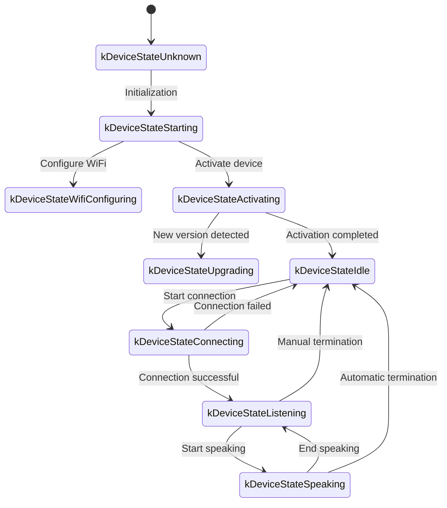
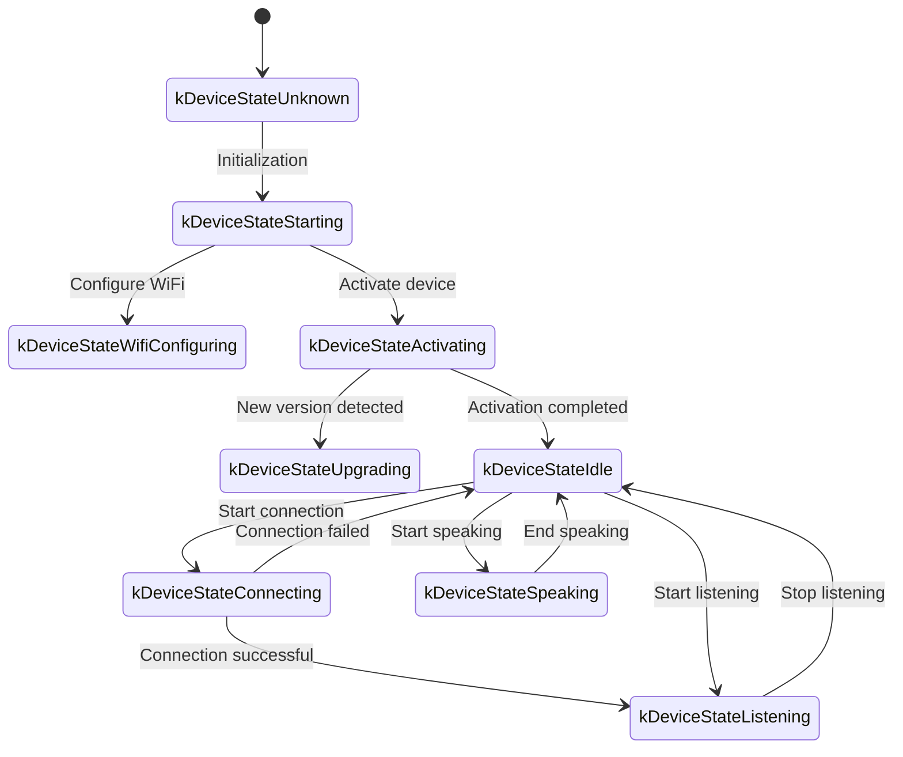

# WebSocket Communication Protocol Documentation

The following is a WebSocket communication protocol documentation based on code implementation, outlining how device-side and server interact through WebSocket.

This documentation is only inferred based on the provided code; actual deployment may require further confirmation or supplementation combined with server-side implementation.

---

## 1. Overall Process Overview

1. **Device-Side Initialization**  
   - Device powers on, initializes `Application`:  
     - Initializes audio codec, display, LED, etc.  
     - Connects to network  
     - Creates and initializes WebSocket protocol instance (`WebsocketProtocol`) implementing `Protocol` interface  
   - Enters main loop waiting for events (audio input, audio output, scheduled tasks, etc.).

2. **Establish WebSocket Connection**  
   - When device needs to start voice session (e.g., user wake-up, manual button trigger, etc.), calls `OpenAudioChannel()`:  
     - Gets WebSocket URL based on configuration
     - Sets several request headers (`Authorization`, `Protocol-Version`, `Device-Id`, `Client-Id`)  
     - Calls `Connect()` to establish WebSocket connection with server  

3. **Device-Side Sends "hello" Message**  
   - After successful connection, device sends a JSON message, example structure as follows:  
   ```json
   {
     "type": "hello",
     "version": 1,
     "features": {
       "mcp": true
     },
     "transport": "websocket",
     "audio_params": {
       "format": "opus",
       "sample_rate": 16000,
       "channels": 1,
       "frame_duration": 60
     }
   }
   ```
   - Where `features` field is optional, content automatically generated based on device compilation configuration. For example: `"mcp": true` indicates support for MCP protocol.
   - `frame_duration` value corresponds to `OPUS_FRAME_DURATION_MS` (e.g., 60ms).

4. **Server Replies "hello"**  
   - Device waits for server to return a JSON message containing `"type": "hello"`, and checks if `"transport": "websocket"` matches.  
   - Server may optionally send `session_id` field, device-side automatically records after receiving.  
   - Example:
   ```json
   {
     "type": "hello",
     "transport": "websocket",
     "session_id": "xxx",
     "audio_params": {
       "format": "opus",
       "sample_rate": 24000,
       "channels": 1,
       "frame_duration": 60
     }
   }
   ```
   - If matches, considers server ready, marks audio channel open successful.  
   - If correct reply not received within timeout period (default 10 seconds), considers connection failed and triggers network error callback.

5. **Subsequent Message Interaction**  
   - Device-side and server-side can send two main types of data:  
     1. **Binary audio data** (Opus encoded)  
     2. **Text JSON messages** (for transmitting chat status, TTS/STT events, MCP protocol messages, etc.)  

   - In code, receive callbacks are mainly divided into:  
     - `OnData(...)`:  
       - When `binary` is `true`, considered as audio frame; device decodes it as Opus data.  
       - When `binary` is `false`, considered as JSON text, needs to be parsed with cJSON on device-side and corresponding business logic processing performed (such as chat, TTS, MCP protocol messages, etc.).  

   - When server or network disconnects, callback `OnDisconnected()` is triggered:  
     - Device calls `on_audio_channel_closed_()`, and eventually returns to idle state.

6. **Close WebSocket Connection**  
   - When device needs to end voice session, calls `CloseAudioChannel()` to actively disconnect, and returns to idle state.  
   - Or if server-side actively disconnects, triggers same callback process.

---

## 2. Common Request Headers

When establishing WebSocket connection, code example sets the following request headers:

- `Authorization`: Used to store access token, format like `"Bearer <token>"`  
- `Protocol-Version`: Protocol version number, consistent with `version` field in hello message body  
- `Device-Id`: Device physical network card MAC address
- `Client-Id`: Software-generated UUID (erasing NVS or re-flashing complete firmware will reset)

These headers are sent to server along with WebSocket handshake, server can perform verification, authentication, etc. as needed.

---

## 3. Binary Protocol Version

Device supports multiple binary protocol versions, specified through `version` field in configuration:

### 3.1 Version 1 (Default)
Directly sends Opus audio data, no additional metadata. Websocket protocol distinguishes text and binary.

### 3.2 Version 2
Uses `BinaryProtocol2` structure:
```c
struct BinaryProtocol2 {
    uint16_t version;        // Protocol version
    uint16_t type;           // Message type (0: OPUS, 1: JSON)
    uint32_t reserved;       // Reserved field
    uint32_t timestamp;      // Timestamp (milliseconds, for server-side AEC)
    uint32_t payload_size;   // Payload size (bytes)
    uint8_t payload[];       // Payload data
} __attribute__((packed));
```

### 3.3 Version 3
Uses `BinaryProtocol3` structure:
```c
struct BinaryProtocol3 {
    uint8_t type;            // Message type
    uint8_t reserved;        // Reserved field
    uint16_t payload_size;   // Payload size
    uint8_t payload[];       // Payload data
} __attribute__((packed));
```

---

## 4. JSON Message Structure

WebSocket text frames transmit in JSON format, below are common `"type"` fields and their corresponding business logic. If message contains fields not listed, they may be optional or specific implementation details.

### 4.1 Device-Side → Server

1. **Hello**  
   - Sent by device-side after successful connection, informs server of basic parameters.  
   - Example:
     ```json
     {
       "type": "hello",
       "version": 1,
       "features": {
         "mcp": true
       },
       "transport": "websocket",
       "audio_params": {
         "format": "opus",
         "sample_rate": 16000,
         "channels": 1,
         "frame_duration": 60
       }
     }
     ```

2. **Listen**  
   - Indicates device-side starts or stops recording listening.  
   - Common fields:  
     - `"session_id"`: Session identifier  
     - `"type": "listen"`  
     - `"state"`: `"start"`, `"stop"`, `"detect"` (wake detection triggered)  
     - `"mode"`: `"auto"`, `"manual"` or `"realtime"`, indicates recognition mode.  
   - Example: Start listening  
     ```json
     {
       "session_id": "xxx",
       "type": "listen",
       "state": "start",
       "mode": "manual"
     }
     ```

3. **Abort**  
   - Terminates current speech (TTS playback) or voice channel.  
   - Example:
     ```json
     {
       "session_id": "xxx",
       "type": "abort",
       "reason": "wake_word_detected"
     }
     ```
   - `reason` value can be `"wake_word_detected"` or others.

4. **Wake Word Detected**  
   - Used by device-side to inform server of detected wake word.
   - Before sending this message, wake word Opus audio data can be sent in advance for server voiceprint detection.  
   - Example:
     ```json
     {
       "session_id": "xxx",
       "type": "listen",
       "state": "detect",
       "text": "Hello Xiaoming"
     }
     ```

5. **MCP**
   - Recommended new generation protocol for IoT control. All device capability discovery, tool calls, etc. are performed through type: "mcp" messages, payload internally is standard JSON-RPC 2.0 (see [MCP Protocol Documentation](./mcp-protocol.md)).
   
   - **Device-side to server sending result example:**
     ```json
     {
       "session_id": "xxx",
       "type": "mcp",
       "payload": {
         "jsonrpc": "2.0",
         "id": 1,
         "result": {
           "content": [
             { "type": "text", "text": "true" }
           ],
           "isError": false
         }
       }
     }
     ```

---

### 4.2 Server → Device-Side

1. **Hello**  
   - Handshake confirmation message returned by server-side.  
   - Must contain `"type": "hello"` and `"transport": "websocket"`.  
   - May contain `audio_params`, indicating audio parameters expected by server, or configuration aligned with device-side.   
   - Server may optionally send `session_id` field, device-side automatically records after receiving.  
   - After successful reception, device-side sets event flag, indicating WebSocket channel ready.

2. **STT**  
   - `{"session_id": "xxx", "type": "stt", "text": "..."}`
   - Indicates server-side recognized user speech. (e.g., speech-to-text result)  
   - Device may display this text on screen, then proceed to answer, etc.

3. **LLM**  
   - `{"session_id": "xxx", "type": "llm", "emotion": "happy", "text": "😀"}`
   - Server instructs device to adjust expression animation / UI expression.  

4. **TTS**  
   - `{"session_id": "xxx", "type": "tts", "state": "start"}`: Server prepares to send TTS audio, device-side enters "speaking" playback state.  
   - `{"session_id": "xxx", "type": "tts", "state": "stop"}`: Indicates this TTS session ends.  
   - `{"session_id": "xxx", "type": "tts", "state": "sentence_start", "text": "..."}`
     - Lets device display current text segment to be played or read on interface (e.g., for displaying to user).  

5. **MCP**
   - Server sends IoT-related control instructions or returns call results through type: "mcp" messages, payload structure same as above.
   
   - **Server to device-side sending tools/call example:**
     ```json
     {
       "session_id": "xxx",
       "type": "mcp",
       "payload": {
         "jsonrpc": "2.0",
         "method": "tools/call",
         "params": {
           "name": "self.light.set_rgb",
           "arguments": { "r": 255, "g": 0, "b": 0 }
         },
         "id": 1
       }
     }
     ```

6. **System**
   - System control commands, commonly used for remote upgrade updates.
   - Example:
     ```json
     {
       "session_id": "xxx",
       "type": "system",
       "command": "reboot"
     }
     ```
   - Supported commands:
     - `"reboot"`: Reboot device

7. **Custom** (Optional)
   - Custom messages, supported when `CONFIG_RECEIVE_CUSTOM_MESSAGE` enabled.
   - Example:
     ```json
     {
       "session_id": "xxx",
       "type": "custom",
       "payload": {
         "message": "Custom content"
       }
     }
     ```

8. **Audio Data: Binary Frames**  
   - When server sends audio binary frames (Opus encoded), device-side decodes and plays.  
   - If device-side is in "listening" (recording) state, received audio frames are ignored or cleared to prevent conflicts.

---

## 5. Audio Codec

1. **Device-Side Sends Recording Data**  
   - Audio input after possible echo cancellation, noise suppression or volume gain, packaged into binary frames through Opus encoding and sent to server.  
   - Depending on protocol version, may directly send Opus data (version 1) or use binary protocol with metadata (version 2/3).

2. **Device-Side Plays Received Audio**  
   - When receiving server binary frames, also considered as Opus data.  
   - Device-side decodes, then hands over to audio output interface for playback.  
   - If server audio sample rate differs from device, resampling is performed after decoding.

---

## 6. Common Status Transitions

Below are common device-side key status transitions, corresponding to WebSocket messages:

1. **Idle** → **Connecting**  
   - User triggers or wakes up, device calls `OpenAudioChannel()` → Establishes WebSocket connection → Sends `"type":"hello"`.  

2. **Connecting** → **Listening**  
   - After successful connection establishment, if continues to execute `SendStartListening(...)`, enters recording state. At this time device continuously encodes microphone data and sends to server.  

3. **Listening** → **Speaking**  
   - Receives server TTS Start message (`{"type":"tts","state":"start"}`) → Stops recording and plays received audio.  

4. **Speaking** → **Idle**  
   - Server TTS Stop (`{"type":"tts","state":"stop"}`) → Audio playback ends. If not continuing to automatic listening, returns to Idle; if configured for automatic loop, enters Listening again.  

5. **Listening** / **Speaking** → **Idle** (encountering exceptions or active interruption)  
   - Calls `SendAbortSpeaking(...)` or `CloseAudioChannel()` → Interrupts session → Closes WebSocket → Status returns to Idle.  

### Automatic Mode Status Transition Diagram



### Manual Mode Status Transition Diagram



---

## 7. Error Handling

1. **Connection Failure**  
   - If `Connect(url)` returns failure or times out waiting for server "hello" message, triggers `on_network_error_()` callback. Device prompts "Unable to connect to service" or similar error message.

2. **Server Disconnection**  
   - If WebSocket abnormally disconnects, callback `OnDisconnected()`:  
     - Device callback `on_audio_channel_closed_()`  
     - Switches to Idle or other retry logic.

---

## 8. Other Considerations

1. **Authentication**  
   - Device provides authentication through setting `Authorization: Bearer <token>`, server-side needs to verify if valid.  
   - If token expires or invalid, server can reject handshake or disconnect later.

2. **Session Control**  
   - Some messages in code contain `session_id`, used to distinguish independent conversations or operations. Server can separate processing for different sessions as needed.

3. **Audio Payload**  
   - Code defaults to using Opus format, sets `sample_rate = 16000`, mono. Frame duration controlled by `OPUS_FRAME_DURATION_MS`, generally 60ms. Can be adjusted appropriately based on bandwidth or performance. For better music playback effect, server downlink audio may use 24000 sample rate.

4. **Protocol Version Configuration**  
   - Configure binary protocol version (1, 2, or 3) through `version` field in settings
   - Version 1: Directly sends Opus data
   - Version 2: Uses binary protocol with timestamp, suitable for server-side AEC
   - Version 3: Uses simplified binary protocol

5. **IoT Control Recommends MCP Protocol**  
   - IoT capability discovery, status synchronization, control instructions, etc. between device and server, recommended to all implement through MCP protocol (type: "mcp"). Original type: "iot" solution deprecated.
   - MCP protocol can transmit over WebSocket, MQTT and other underlying protocols, has better scalability and standardization capability.
   - For detailed usage, refer to [MCP Protocol Documentation](./mcp-protocol.md) and [MCP IoT Control Usage](./mcp-usage.md).

6. **Error or Abnormal JSON**  
   - When JSON lacks necessary fields, e.g., `{"type": ...}`, device-side records error log (`ESP_LOGE(TAG, "Missing message type, data: %s", data);`), does not execute any business.

---

## 9. Message Examples

Below gives a typical bidirectional message example (process simplified illustration):

1. **Device-Side → Server** (Handshake)
   ```json
   {
     "type": "hello",
     "version": 1,
     "features": {
       "mcp": true
     },
     "transport": "websocket",
     "audio_params": {
       "format": "opus",
       "sample_rate": 16000,
       "channels": 1,
       "frame_duration": 60
     }
   }
   ```

2. **Server → Device-Side** (Handshake Response)
   ```json
   {
     "type": "hello",
     "transport": "websocket",
     "session_id": "xxx",
     "audio_params": {
       "format": "opus",
       "sample_rate": 16000
     }
   }
   ```

3. **Device-Side → Server** (Start Listening)
   ```json
   {
     "session_id": "xxx",
     "type": "listen",
     "state": "start",
     "mode": "auto"
   }
   ```
   Simultaneously device-side starts sending binary frames (Opus data).

4. **Server → Device-Side** (ASR Result)
   ```json
   {
     "session_id": "xxx",
     "type": "stt",
     "text": "User's spoken words"
   }
   ```

5. **Server → Device-Side** (TTS Start)
   ```json
   {
     "session_id": "xxx",
     "type": "tts",
     "state": "start"
   }
   ```
   Then server sends binary audio frames to device-side for playback.

6. **Server → Device-Side** (TTS End)
   ```json
   {
     "session_id": "xxx",
     "type": "tts",
     "state": "stop"
   }
   ```
   Device-side stops playing audio, if no more instructions, returns to idle state.

---

## 10. Summary

This protocol completes functions including audio stream upload, TTS audio playback, speech recognition and status management, MCP instruction delivery, etc. by transmitting JSON text and binary audio frames over WebSocket. Its core characteristics:

- **Handshake Phase**: Sends `"type":"hello"`, waits for server response.  
- **Audio Channel**: Uses Opus encoded binary frames for bidirectional voice stream transmission, supports multiple protocol versions.  
- **JSON Messages**: Uses `"type"` as core field to identify different business logic, including TTS, STT, MCP, WakeWord, System, Custom, etc.  
- **Extensibility**: Can add fields to JSON messages as needed, or perform additional authentication in headers.

Server and device-side need to agree in advance on the meaning of various message fields, timing logic, and error handling rules to ensure smooth communication. The above information can serve as basic documentation for subsequent integration, development, or expansion.
